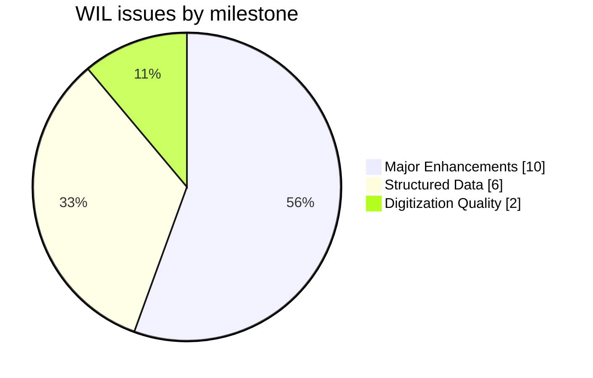
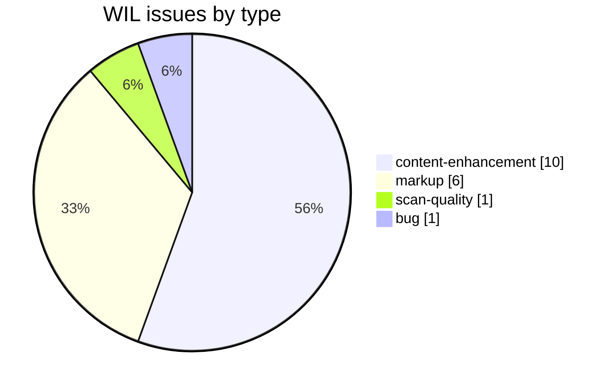
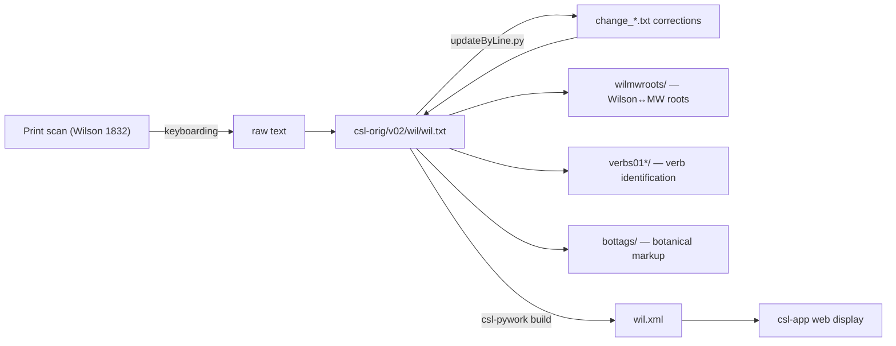

# WIL — Wilson *A Dictionary, Sanscrit and English* (1832)

Development and correction repository for **Horace Hayman Wilson's *A Dictionary, Sanscrit and English*, 2nd edition (Calcutta, 1832)**, a Sanskrit→English dictionary, part of the [Cologne Digital Sanskrit Lexicon](https://www.sanskrit-lexicon.uni-koeln.de/) (CDSL). The canonical source text lives in [`csl-orig/v02/wil/wil.txt`](https://github.com/sanskrit-lexicon/csl-orig/blob/master/v02/wil/wil.txt) (44,577 entries); this repository holds the development, correction, and enrichment work — Wilson↔Monier-Williams root correspondence, verb identification, botanical-name markup, and per-issue corrections.

Wilson (1832) is the earliest dictionary in the CDSL collection and a documented ancestor of later works (Yates 1846, Goldstücker, Śabda-Sāgara), which is why much of the work here is **comparative** (`wilmwroots/`, `verbs01*/`, `maprep/`).

## Documentation

- [CLAUDE.md](CLAUDE.md) — repository guide and data-format reference.
- [DATA_DICTIONARY.md](DATA_DICTIONARY.md) — markup tag reference.
- [CONTRIBUTING.md](CONTRIBUTING.md) · [CODE_OF_CONDUCT.md](CODE_OF_CONDUCT.md)

## Contents

| Path | Purpose |
|---|---|
| `wilmwroots/` | Wilson ↔ Monier-Williams root correspondence (step1, step2, step2a; reason codes) |
| `verbs01/` | Wilson verb entries mapped to MW roots, with Devanāgarī renderings |
| `verbs01-yat/` | Yates verb entries mapped to MW (cross-dictionary comparison) |
| `verbs01-shs/` | Śabda-Sāgara (SHS) verb entries mapped to MW |
| `maprep/` | Ahlborn-Scharf (2011) MW↔Wilson headword comparison working papers |
| `wiltab2011/`, `wiltabwork/` | Wilson headword-table working files |
| `bottags/` | Botanical-name tagging (`<bot>` markup) |
| `alphawork/` | Headword alphabetization / ordering work |
| `issues/` | Per-issue working files |
| `CITATION.cff` | Machine-readable citation metadata |
| `DATA_DICTIONARY.md` | Markup tag reference |
| `WIL_1819_page59_iast.pdf` | Sample scan page (IAST) |

## Timeline

| Period | Activity |
|---|---|
| 2011 | Ahlborn-Scharf MW↔Wilson headword comparison (`maprep/`, `wiltab2011/`) |
| 2015-02 | MW↔Wilson root-correspondence work begins (`wilmwroots/`) |
| 2016 | Devanāgarī markup normalization; reason-code documentation |
| 2018–2020 | Root correspondence step2a; verb identification (`verbs01`, `verbs01-yat`, `verbs01-shs`) |
| 2020–2022 | Markup fixes; botanical-name tagging (`bottags/`); new hi-res scan from Russia |
| 2026-05 | Andhrabharati-data improvement, markup-oddities fix, issue taxonomy, documentation |

## Projects & Milestones

| Milestone | Open | Closed | Total |
|---|---|---|---|
| Dictionary to Book | 0 | 0 | 0 |
| Digitization Quality | 2 | 0 | 2 |
| Structured Data | 4 | 2 | 6 |
| Major Enhancements | 8 | 2 | 10 |
| **Total** | **14** | **4** | **18** |

## Issues

### Open

| # | Title | Type | Severity | Milestone |
|---|---|---|---|---|
| 1 | Correspondence between roots in MW and Wilson | content-enhancement | medium | Major Enhancements |
| 2 | Wilson roots correspondence to MW roots | content-enhancement | medium | Major Enhancements |
| 3 | Wilson roots correspondence to MW roots, step2 | content-enhancement | medium | Major Enhancements |
| 6 | Wilson roots correspondence to MW roots, step2a | content-enhancement | medium | Major Enhancements |
| 7 | Spaces and commas outside markup | markup | minor | Structured Data |
| 8 | verbs01: Wilson verbs and MW | content-enhancement | medium | Major Enhancements |
| 9 | verbs01-yat: Yates verbs and MW | content-enhancement | medium | Major Enhancements |
| 10 | verbs01-shs: Sabda Sagara verbs and MW | content-enhancement | medium | Major Enhancements |
| 11 | Botanical names | markup | minor | Structured Data |
| 12 | Bot markup refinement | markup | minor | Structured Data |
| 13 | New Hi-Res Scan of Wilson 1832 from Russia | scan-quality | minor | Digitization Quality |
| 14 | Error 500: semi-digitized edition, 2008 | bug | minor | Digitization Quality |
| 16 | WIL — atiSaya — abnormal lex tags | markup | minor | Structured Data |
| 18 | docs-pass: WIL documentation review | content-enhancement | medium | Major Enhancements |

### Solved

| # | Title | Type | Severity | Milestone |
|---|---|---|---|---|
| 4 | Documentation of wilmwroots reason codes | content-enhancement | medium | Major Enhancements |
| 5 | Normalizing Devanagari markup in wil.txt | markup | minor | Structured Data |
| 15 | WIL improvement with AB data | content-enhancement | medium | Major Enhancements |
| 17 | [markup] Minor wil.txt Markup Oddities | markup | minor | Structured Data |

## Labels

### Type labels
| Label | Meaning |
|---|---|
| `link-target` | Click-throughs from `<ls>` abbreviations to scanned PDF pages |
| `link-splitting` | Splitting combined `SOURCE N,N` refs into per-page links |
| `markup` | Normalising XML tag content |
| `text-correction` | Corrections to English/Sanskrit definitions or headwords |
| `content-enhancement` | New material or structural additions beyond correction |
| `encoding` | SLP1/IAST transcoding, character normalisation |
| `scan-quality` | Replacing blurry/skewed/missing scan pages |
| `bug` | Broken links, XML errors, broken downloads |
| `question` | Scholarly questions requiring research |

### Severity labels
| Label | Meaning |
|---|---|
| `minor` | Targeted fix — a handful of lines or a single file |
| `medium` | Standard unit of work — one batch of corrections |
| `hard` | Large effort spanning many sources or files |

## Contributors

| Contributor | Commits |
|---|---|
| funderburkjim | 35 |
| drdhaval2785 | 33 |
| gasyoun (Mārcis Gasūns) | 8 |

## Source

- **Author**: Wilson, Horace Hayman
- **Title**: *A Dictionary, Sanscrit and English*
- **Edition**: 2nd edition
- **Place / Publisher**: Calcutta: Education Press
- **Year**: 1832
- **Language pair**: Sanskrit → English
- **Entries (digital edition)**: 44,577
- **License (digital edition)**: CC BY-SA 4.0
- See [CITATION.cff](CITATION.cff) for machine-readable citation.

## Encoding

- UTF-8 (NFC) throughout.
- Sanskrit text in SLP1 transliteration, wrapped in `{#…#}`; English gloss / italic display text in ``.
- Proper names appear in IAST capitals in the source (e.g. `VIṢṆU`).
- Devanāgarī and IAST display forms are generated at display time, not stored in the source.

## How it works

---
*Issue taxonomy and documentation per the [Cologne issue runbook](https://github.com/sanskrit-lexicon/csl-observatory/blob/main/runbook/cologne-issue-runbook.md).*
