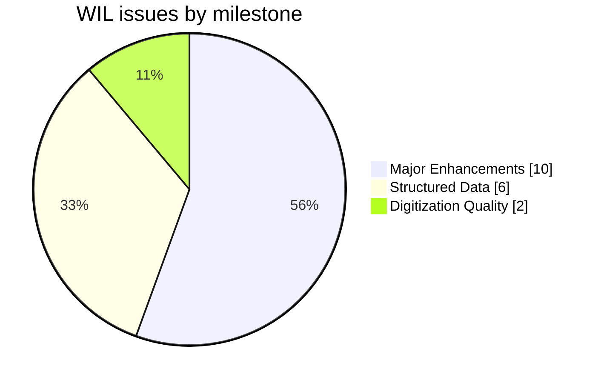
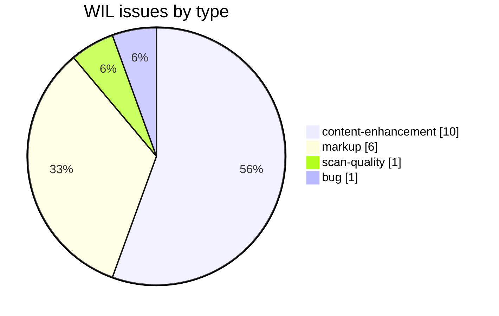
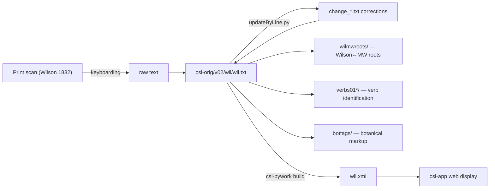

# WIL — Wilson *A Dictionary, Sanscrit and English* (1832)

_Created: 28-12-2014 · Last updated: 06-08-2026_

Development and correction repository for **Horace Hayman Wilson's *A Dictionary, Sanscrit and English*, 2nd edition (Calcutta, 1832)**, a Sanskrit→English dictionary, part of the [Cologne Digital Sanskrit Lexicon](https://www.sanskrit-lexicon.uni-koeln.de/) (CDSL). The canonical source text lives in [`csl-orig/v02/wil/wil.txt`](https://github.com/sanskrit-lexicon/csl-orig/blob/main/v02/wil/wil.txt) (44,577 entries); this repository holds the development, correction, and enrichment work — Wilson↔Monier-Williams root correspondence, verb identification, botanical-name markup, and per-issue corrections.

Wilson **1832** is the CDSL text and the English-gloss base of [MW72](https://github.com/sanskrit-lexicon/MW72) (and thus of MW1899's carried-forward English). Wilson **1819** (1st ed.) is the print base of [PWG](https://github.com/sanskrit-lexicon/PWG) and is **not** fully OCR'd at Cologne — see the lineage note below. Full 1819 body digitisation is out of scope for now; the **1819 front matter** (53 pages: title, dedication, preface i–xlvii, authorities, transliteration table) is fully OCR'd in [`prefaces/`](https://github.com/sanskrit-lexicon/WIL/tree/main/prefaces) — see [Front matter](#front-matter-1819-prefaces) below.

Wilson (1832) is the earliest dictionary **body** in the CDSL collection and a documented ancestor of later works (Yates 1846, Goldstücker, Śabda-Sāgara), which is why much of the work here is **comparative** ([`wilmwroots/`](https://github.com/sanskrit-lexicon/WIL/tree/main/wilmwroots), [`verbs01/`](https://github.com/sanskrit-lexicon/WIL/tree/main/verbs01), [`maprep/`](https://github.com/sanskrit-lexicon/WIL/tree/main/maprep)).

## Documentation

- [docs/WIL_EDITION_LINEAGE_1819_1832.md](https://github.com/sanskrit-lexicon/WIL/blob/main/docs/WIL_EDITION_LINEAGE_1819_1832.md) — **1819 vs 1832**, PWG/MW72/MW chain, `L.`/`W.` distinction, OCR status, preface-only scope for 1819
- [CLAUDE.md](https://github.com/sanskrit-lexicon/WIL/blob/main/CLAUDE.md) — repository guide and data-format reference.
- [DATA_DICTIONARY.md](https://github.com/sanskrit-lexicon/WIL/blob/main/DATA_DICTIONARY.md) — markup tag reference.
- [CONTRIBUTING.md](https://github.com/sanskrit-lexicon/WIL/blob/main/CONTRIBUTING.md) · [CODE_OF_CONDUCT.md](https://github.com/sanskrit-lexicon/WIL/blob/main/CODE_OF_CONDUCT.md)

## Contents

| Path | Purpose |
|---|---|
| [`wilmwroots/`](https://github.com/sanskrit-lexicon/WIL/tree/main/wilmwroots) | Wilson ↔ Monier-Williams root correspondence (step1, step2, step2a; reason codes) |
| [`verbs01/`](https://github.com/sanskrit-lexicon/WIL/tree/main/verbs01) | Wilson verb entries mapped to MW roots, with Devanāgarī renderings |
| [`verbs01-yat/`](https://github.com/sanskrit-lexicon/WIL/tree/main/verbs01-yat) | Yates verb entries mapped to MW (cross-dictionary comparison) |
| [`verbs01-shs/`](https://github.com/sanskrit-lexicon/WIL/tree/main/verbs01-shs) | Śabda-Sāgara (SHS) verb entries mapped to MW |
| [`maprep/`](https://github.com/sanskrit-lexicon/WIL/tree/main/maprep) | Ahlborn-Scharf (2011) MW↔Wilson headword comparison working papers |
| [`wiltab2011/`](https://github.com/sanskrit-lexicon/WIL/tree/main/wiltab2011), [`wiltabwork/`](https://github.com/sanskrit-lexicon/WIL/tree/main/wiltabwork) | Wilson headword-table working files |
| [`bottags/`](https://github.com/sanskrit-lexicon/WIL/tree/main/bottags) | Botanical-name tagging (`<bot>` markup) |
| [`alphawork/`](https://github.com/sanskrit-lexicon/WIL/tree/main/alphawork) | Headword alphabetization / ordering work |
| [`issues/`](https://github.com/sanskrit-lexicon/WIL/tree/main/issues) | Per-issue working files |
| [`CITATION.cff`](https://github.com/sanskrit-lexicon/WIL/blob/main/CITATION.cff) | Machine-readable citation metadata |
| [`DATA_DICTIONARY.md`](https://github.com/sanskrit-lexicon/WIL/blob/main/DATA_DICTIONARY.md) | Markup tag reference |
| [`docs/WIL_EDITION_LINEAGE_1819_1832.md`](https://github.com/sanskrit-lexicon/WIL/blob/main/docs/WIL_EDITION_LINEAGE_1819_1832.md) | Edition lineage: 1819 (PWG base) vs 1832 (CDSL/MW72 base); OCR gaps |
| [`WIL_1819_page59_iast.pdf`](https://github.com/sanskrit-lexicon/WIL/blob/main/WIL_1819_page59_iast.pdf) | Sample **1819** scan page only (IAST) — superseded by [`prefaces/wil1819pref53.md`](https://github.com/sanskrit-lexicon/WIL/blob/main/prefaces/wil1819pref53.md) |
| [`prefaces/`](https://github.com/sanskrit-lexicon/WIL/tree/main/prefaces) | **1819 first-edition front-matter OCR** — 53 pages + consolidated EN edition; see [Front matter](#front-matter-1819-prefaces) below |

## Front matter 1819 (`prefaces/`)

OCR transcription of the complete front matter of the **1819 first edition** (Calcutta: Philip Pereira, Hindoostanee Press) — **not** the 1832 second edition that the CDSL `wil` text digitises. 53 pages: title page · dedication (iii–iv, dated *Calcutta, October 1819*, signed H. H. WILSON) · preface (i–xlvii) · "Explanation of the abbreviated References" (xlviii–xlix) · "Application of the Roman Character to the Nágarí alphabet" (l).

- **Scan source:** [archive.org: wilson-a-dictionary-in-sanscrit-and-english-1819](https://archive.org/details/wilson-a-dictionary-in-sanscrit-and-english-1819) (Google digitisation of the Bayerische Staatsbibliothek copy, Public Domain Mark). Cologne csldoc has **no** 1819 front-matter scans (its WIL prefaces are 1832, OCR'd in [Wil-YAT](https://github.com/sanskrit-lexicon/Wil-YAT/tree/main/prefaces)).
- **Files:** per-page [`prefaces/wil1819prefNN.md`](https://github.com/sanskrit-lexicon/WIL/tree/main/prefaces) (faithful English transcriptions, YAML provenance headers with per-leaf IIIF links) · consolidated [`prefaces/wil1819pref_all.en.md`](https://github.com/sanskrit-lexicon/WIL/blob/main/prefaces/wil1819pref_all.en.md) · index [`prefaces/README.md`](https://github.com/sanskrit-lexicon/WIL/blob/main/prefaces/README.md) · QA [`prefaces/AUDIT_A_VS_B.md`](https://github.com/sanskrit-lexicon/WIL/blob/main/prefaces/AUDIT_A_VS_B.md).
- Source language is English, so the transcription *is* the English edition (no separate `.en.md`); RU translation not produced in this pass.

### OCR run notes (2026-08-05/06) — cost, timing, and technical lessons

Produced by the `/cologne-preface-ocr` skill (Engine A vision OCR, subagent fan-out) executing handoff H2213. Process retrospective, not part of the deliverable.

**Cost.** Subagents (exact, from harness telemetry): 19 successful OCR agents, ≈2.76 M output tokens, ≈895 tool calls; 4 further agents died mid-run on API stalls (partial unreported cost, est. 0.2–0.4 M) and their pages were re-run. Main thread (estimate; leaf mapping, downloads, QA spot-checks, audit, consolidation): ≈0.2 M. **Total ≈3.2 M tokens.**

**Time.** Wall-clock ≈2.5 h, gated by the archive.org IIIF download (~25 s/leaf × 54 leaves, run in background) and by the slowest OCR agents (Devanagari-dense pages xl–xlii took ~50 min).

**Technical lessons (reusable):**
1. Archive.org items expose per-leaf full-resolution images via IIIF (`https://iiif.archive.org/iiif/<item>$<leaf>/full/full/0/default.jpg`) — no need for the 2.3 GB `_jp2.zip`.
2. The IA `hocr_searchtext` + `hocr_pageindex` files are a free Engine-B channel: per-leaf Tesseract text for the exact same scans, used for the A-vs-B audit without running Tesseract locally.
3. Interrupted `urllib` downloads leave truncated-but-large JPEGs that a size check passes; verify with a full `PIL` decode before OCR (two leaves needed refetch).
4. Google-Books quarto scans carry heavy show-through; Tesseract recall collapses there (0.38–0.50) while vision reading at native-resolution crops stays clean — flags on such pages are B-side false positives.
5. Agents on 3-page batches with "write each file as soon as its page is done" survive API stalls losslessly; agents that hold all pages in memory lose everything on a stall.

## Timeline

| Period | Activity |
|---|---|
| 2011 | Ahlborn-Scharf MW↔Wilson headword comparison ([`maprep/`](https://github.com/sanskrit-lexicon/WIL/tree/main/maprep), [`wiltab2011/`](https://github.com/sanskrit-lexicon/WIL/tree/main/wiltab2011)) |
| 2015-02 | MW↔Wilson root-correspondence work begins ([`wilmwroots/`](https://github.com/sanskrit-lexicon/WIL/tree/main/wilmwroots)) |
| 2016 | Devanāgarī markup normalization; reason-code documentation |
| 2018–2020 | Root correspondence step2a; verb identification ([`verbs01`](https://github.com/sanskrit-lexicon/WIL/tree/main/verbs01), [`verbs01-yat`](https://github.com/sanskrit-lexicon/WIL/tree/main/verbs01-yat), [`verbs01-shs`](https://github.com/sanskrit-lexicon/WIL/tree/main/verbs01-shs)) |
| 2020–2022 | Markup fixes; botanical-name tagging ([`bottags/`](https://github.com/sanskrit-lexicon/WIL/tree/main/bottags)); new hi-res scan from Russia |
| 2026-05 | Andhrabharati-data improvement, markup-oddities fix, issue taxonomy, documentation |
| 2026-08 | **1819 front-matter OCR** — 53 pages transcribed + consolidated EN edition ([`prefaces/`](https://github.com/sanskrit-lexicon/WIL/tree/main/prefaces), H2213) |

## Projects & Milestones

| Milestone | Open | Closed | Total |
|---|---|---|---|
| Dictionary to Book | 0 | 0 | 0 |
| Digitization Quality | 2 | 0 | 2 |
| Structured Data | 4 | 2 | 6 |
| Major Enhancements | 8 | 2 | 10 |
| **Total** | **14** | **4** | **18** |

```mermaid
pie showData
  title WIL issues by milestone
  "Major Enhancements" : 10
  "Structured Data" : 6
  "Digitization Quality" : 2
```

## Issues

```mermaid
pie showData
  title WIL issues by type
  "content-enhancement" : 10
  "markup" : 6
  "scan-quality" : 1
  "bug" : 1
```

### Open

| # | Title | Type | Severity | Milestone |
|---|---|---|---|---|
| [1](https://github.com/sanskrit-lexicon/WIL/issues/1) | Correspondence between roots in MW and Wilson | content-enhancement | medium | Major Enhancements |
| [2](https://github.com/sanskrit-lexicon/WIL/issues/2) | Wilson roots correspondence to MW roots | content-enhancement | medium | Major Enhancements |
| [3](https://github.com/sanskrit-lexicon/WIL/issues/3) | Wilson roots correspondence to MW roots, step2 | content-enhancement | medium | Major Enhancements |
| [6](https://github.com/sanskrit-lexicon/WIL/issues/6) | Wilson roots correspondence to MW roots, step2a | content-enhancement | medium | Major Enhancements |
| [7](https://github.com/sanskrit-lexicon/WIL/issues/7) | Spaces and commas outside markup | markup | minor | Structured Data |
| [8](https://github.com/sanskrit-lexicon/WIL/issues/8) | verbs01: Wilson verbs and MW | content-enhancement | medium | Major Enhancements |
| [9](https://github.com/sanskrit-lexicon/WIL/issues/9) | verbs01-yat: Yates verbs and MW | content-enhancement | medium | Major Enhancements |
| [10](https://github.com/sanskrit-lexicon/WIL/issues/10) | verbs01-shs: Sabda Sagara verbs and MW | content-enhancement | medium | Major Enhancements |
| [11](https://github.com/sanskrit-lexicon/WIL/issues/11) | Botanical names | markup | minor | Structured Data |
| [12](https://github.com/sanskrit-lexicon/WIL/issues/12) | Bot markup refinement | markup | minor | Structured Data |
| [13](https://github.com/sanskrit-lexicon/WIL/issues/13) | New Hi-Res Scan of Wilson 1832 from Russia | scan-quality | minor | Digitization Quality |
| [14](https://github.com/sanskrit-lexicon/WIL/issues/14) | Error 500: semi-digitized edition, 2008 | bug | minor | Digitization Quality |
| [16](https://github.com/sanskrit-lexicon/WIL/issues/16) | WIL — atiSaya — abnormal lex tags | markup | minor | Structured Data |
| [18](https://github.com/sanskrit-lexicon/WIL/issues/18) | docs-pass: WIL documentation review | content-enhancement | medium | Major Enhancements |

### Solved

| # | Title | Type | Severity | Milestone |
|---|---|---|---|---|
| [4](https://github.com/sanskrit-lexicon/WIL/issues/4) | Documentation of wilmwroots reason codes | content-enhancement | medium | Major Enhancements |
| [5](https://github.com/sanskrit-lexicon/WIL/issues/5) | Normalizing Devanagari markup in wil.txt | markup | minor | Structured Data |
| [15](https://github.com/sanskrit-lexicon/WIL/issues/15) | WIL improvement with AB data | content-enhancement | medium | Major Enhancements |
| [17](https://github.com/sanskrit-lexicon/WIL/issues/17) | [markup] Minor wil.txt Markup Oddities | markup | minor | Structured Data |

## Labels

### Type labels
| Label | Meaning |
|---|---|
| `link-target` | Click-throughs from `<ls>` abbreviations to scanned PDF pages |
| `link-splitting` | Splitting combined `SOURCE N,N` refs into per-page links |
| `markup` | Normalising XML tag content |
| `text-correction` | Corrections to English/Sanskrit definitions or headwords |
| `content-enhancement` | New material or structural additions beyond correction |
| `encoding` | SLP1/IAST transcoding, character normalisation |
| `scan-quality` | Replacing blurry/skewed/missing scan pages |
| `bug` | Broken links, XML errors, broken downloads |
| `question` | Scholarly questions requiring research |

### Severity labels
| Label | Meaning |
|---|---|
| `minor` | Targeted fix — a handful of lines or a single file |
| `medium` | Standard unit of work — one batch of corrections |
| `hard` | Large effort spanning many sources or files |

## Contributors

| Contributor | Commits |
|---|---|
| funderburkjim | 35 |
| drdhaval2785 | 33 |
| gasyoun (Mārcis Gasūns) | 8 |

## Source

- **Author**: Wilson, Horace Hayman
- **Title**: *A Dictionary, Sanscrit and English*
- **Edition**: 2nd edition
- **Place / Publisher**: Calcutta: Education Press
- **Year**: 1832
- **Language pair**: Sanskrit → English
- **Entries (digital edition)**: 44,577
- **License (digital edition)**: CC BY-SA 4.0
- See [CITATION.cff](https://github.com/sanskrit-lexicon/WIL/blob/main/CITATION.cff) for machine-readable citation.

## Encoding

- UTF-8 (NFC) throughout.
- Sanskrit text in SLP1 transliteration, wrapped in `{#…#}`; English gloss / italic display text in ``.
- Proper names appear in IAST capitals in the source (e.g. `VIṢṆU`).
- Devanāgarī and IAST display forms are generated at display time, not stored in the source.

## Correcting the source text

Corrections are never edited directly into the canonical source. They are expressed as `change_*.txt` change files applied by scripts (`updateByLine.py`) against [`csl-orig/v02/wil/wil.txt`](https://github.com/sanskrit-lexicon/csl-orig/blob/main/v02/wil/wil.txt). The full workflow (snapshot → `updateByLine.py` → promote → generate → XML-validate → audit → commit) and every gotcha live in the canonical [correction-workflow.md](https://github.com/sanskrit-lexicon/csl-corrections/blob/main/docs/correction-workflow.md).

## How it works

```mermaid
flowchart LR
  S["Print scan (Wilson 1832)"] -->|keyboarding| R["raw text"]
  R --> O["csl-orig/v02/wil/wil.txt"]
  O -->|updateByLine.py| C["change_*.txt corrections"]
  C --> O
  O --> W["wilmwroots/ — Wilson↔MW roots"]
  O --> V["verbs01*/ — verb identification"]
  O --> B["bottags/ — botanical markup"]
  O -->|csl-pywork build| X["wil.xml"]
  X --> A["csl-app web display"]
```

---
*Issue taxonomy and documentation per the [Cologne issue runbook](https://github.com/sanskrit-lexicon/csl-observatory/blob/main/runbook/cologne-issue-runbook.md).*

_Dr. Mārcis Gasūns_
